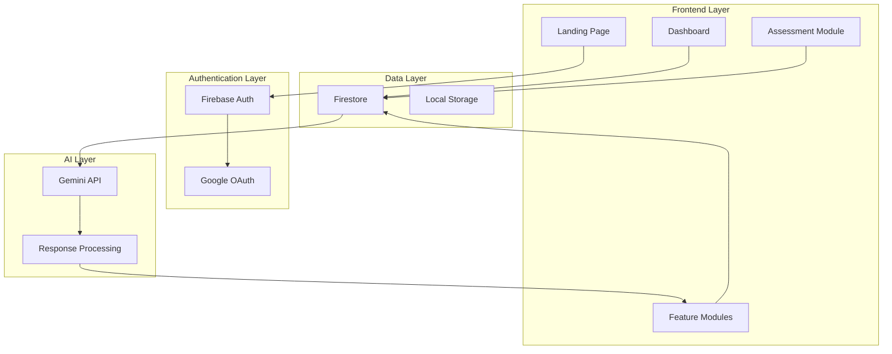
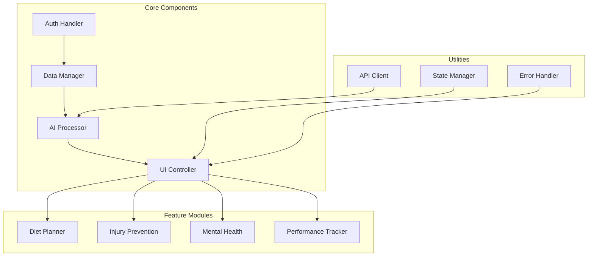
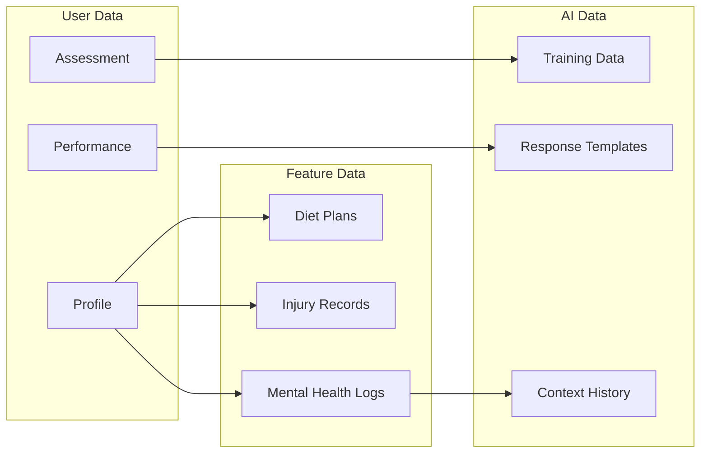
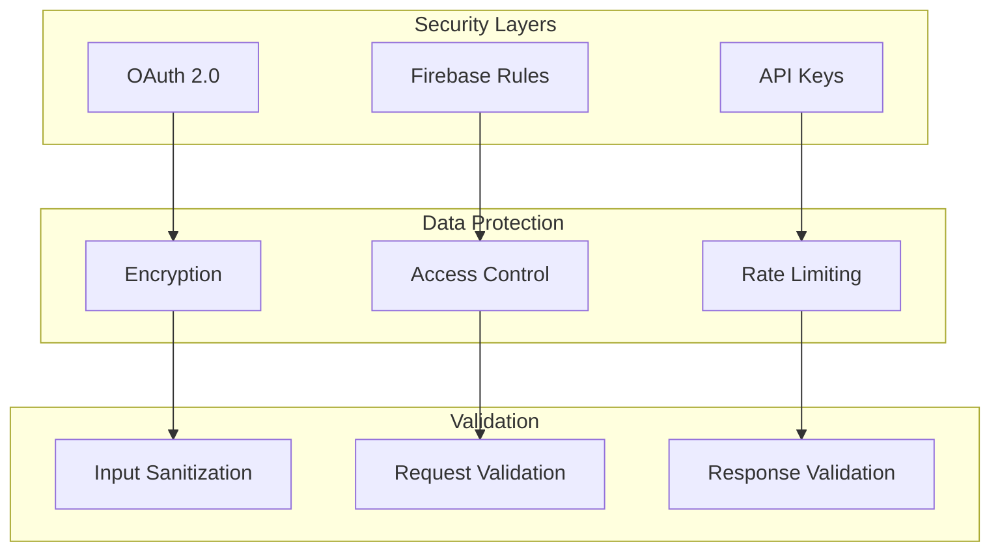
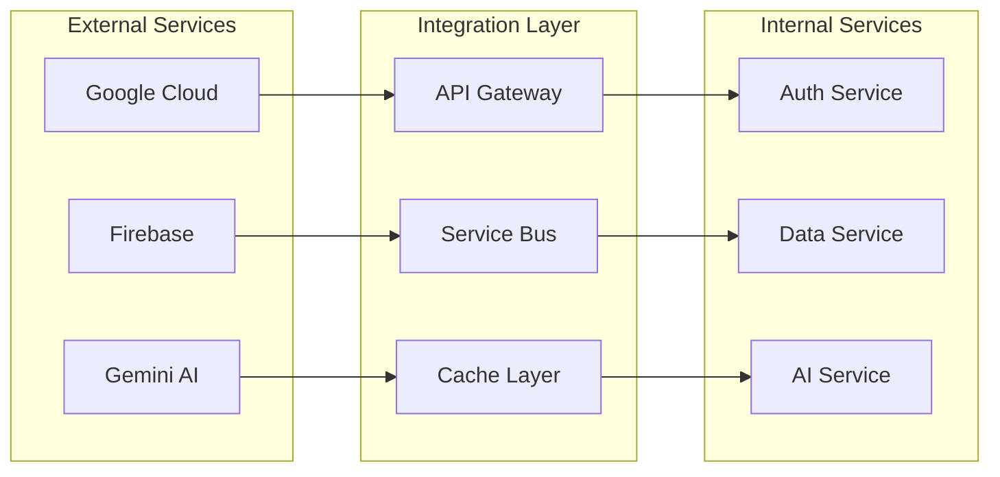

# AthleteAI System Architecture

## 1. High-Level Architecture

```mermaid
graph TD
    subgraph "Frontend Layer"
        A[Landing Page]
        B[Dashboard]
        C[Assessment Module]
        D[Feature Modules]
    end

    subgraph "Authentication Layer"
        E[Firebase Auth]
        F[Google OAuth]
    end

    subgraph "Data Layer"
        G[Firestore]
        H[Local Storage]
    end

    subgraph "AI Layer"
        I[Gemini API]
        J[Response Processing]
    end

    A --> E
    B --> G
    C --> G
    D --> G
    E --> F
    G --> I
    I --> J
    J --> D
```

## 2. Component Architecture

```mermaid
graph TD
    subgraph "Core Components"
        A[Auth Handler]
        B[Data Manager]
        C[AI Processor]
        D[UI Controller]
    end

    subgraph "Feature Modules"
        E[Diet Planner]
        F[Injury Prevention]
        G[Mental Health]
        H[Performance Tracker]
    end

    subgraph "Utilities"
        I[API Client]
        J[State Manager]
        K[Error Handler]
    end

    A --> B
    B --> C
    C --> D
    D --> E
    D --> F
    D --> G
    D --> H
    I --> C
    J --> D
    K --> D
```

## 3. Data Architecture

```mermaid
graph LR
    subgraph "User Data"
        A[Profile]
        B[Assessment]
        C[Performance]
    end

    subgraph "Feature Data"
        D[Diet Plans]
        E[Injury Records]
        F[Mental Health Logs]
    end

    subgraph "AI Data"
        G[Training Data]
        H[Response Templates]
        I[Context History]
    end

    A --> D
    A --> E
    A --> F
    B --> G
    C --> H
    F --> I
```

## 4. Security Architecture

```mermaid
graph TD
    subgraph "Security Layers"
        A[OAuth 2.0]
        B[Firebase Rules]
        C[API Keys]
    end

    subgraph "Data Protection"
        D[Encryption]
        E[Access Control]
        F[Rate Limiting]
    end

    subgraph "Validation"
        G[Input Sanitization]
        H[Request Validation]
        I[Response Validation]
    end

    A --> D
    B --> E
    C --> F
    D --> G
    E --> H
    F --> I
```

## 5. Integration Architecture

```mermaid
graph LR
    subgraph "External Services"
        A[Google Cloud]
        B[Firebase]
        C[Gemini AI]
    end

    subgraph "Internal Services"
        D[Auth Service]
        E[Data Service]
        F[AI Service]
    end

    subgraph "Integration Layer"
        G[API Gateway]
        H[Service Bus]
        I[Cache Layer]
    end

    A --> G
    B --> H
    C --> I
    G --> D
    H --> E
    I --> F
```
