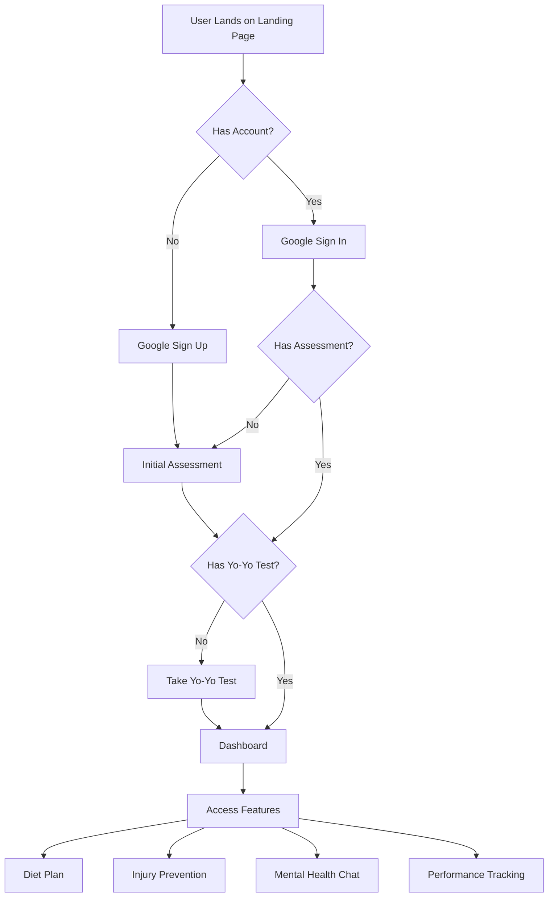
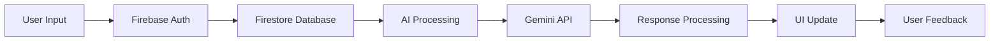
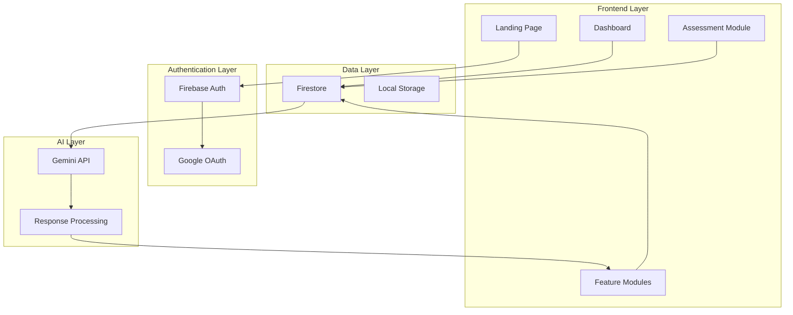
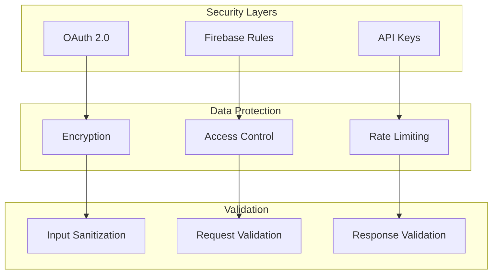

# AthleteAI Process Flow

## 1. User Journey Flow

### Tools Used:
<table>
  <tr>
    <td></td>
    <td></td>
    <td></td>
    <td></td>
  </tr>
</table>

## 2. Data Flow

### Tools Used:
<table>
  <tr>
    <td></td>
    <td></td>
    <td></td>
    <td></td>
  </tr>
</table>

# AthleteAI System Architecture

## 1. High-Level Architecture

### Tools Used:
<table>
  <tr>
    <td></td>
    <td></td>
    <td></td>
    <td></td>
  </tr>
</table>

## 2. Security Architecture

### Security Tools Used:
<table>
  <tr>
    <td></td>
    <td></td>
    <td></td>
    <td></td>
  </tr>
</table>

---

## **Instructions:**
1. **Replace `IMAGE_LINK_FOR_*`** with the actual image links after uploading icons to GitHub.
2. **Ensure all tools & services have relevant icons.**
3. **Commit the updated Markdown file in your GitHub repository.**

This will create a visually appealing documentation with images and diagrams! 🚀
